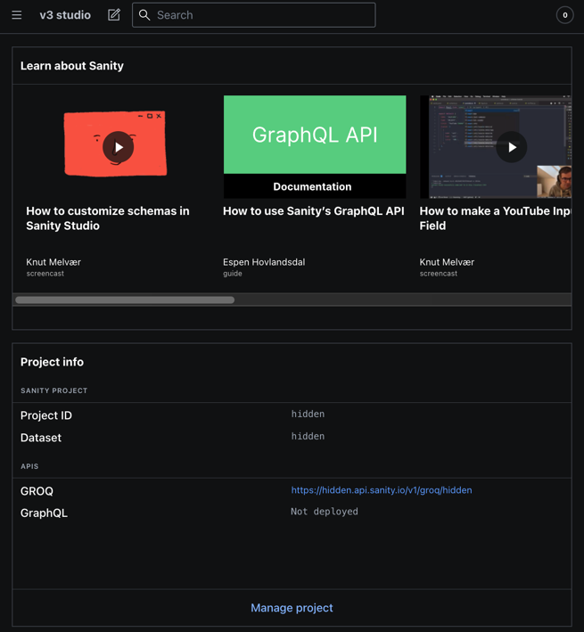

Sanity Dashboard

> For the v2 version, please refer to the [v2-branch](https://github.com/sanity-io/dashboard/tree/studio-v2).

## What is it?

Dashboard is a Sanity Content Studio Tool which renders any widgets configured for it.
Install this plugin in your Studio to display stats about your project, recently edited documents, etc.

The Dashboard tool has been designed to be as generic as possible, making few assumptions about its widgets.
The Dashboard itself is mostly concerned about the layout of the configured widgets.



## Install

In your Sanity Content Studio run:

`npm install --save @sanity/dashboard`

or

`yarn add @sanity/dashboard`

## Basic usage

In `sanity.config.js` (or .ts), add the dashboard tool to the defineConfig plugins array:

```ts
import {defineConfig} from 'sanity'
import {dashboardTool} from '@sanity/dashboard'
export default defineConfig({
  /* ... */
  plugins: [dashboardTool({widgets: []})],
})
```

To verify that all is well, fire up your Studio (`sanity start`) and point your browser to `http://localhost:3333/dashboard`.
It should show an empty dashboard, with a message encouraging you to add some widgets to the dashboard.

## How to configure the Dashboard

Now, add any widgets you might want. The dashboard plugin provides three widgets out-of-the-box:

```ts
import {defineConfig} from 'sanity'
import {
  dashboardTool,
  sanityTutorialsWidget,
  projectUsersWidget,
  projectInfoWidget,
} from '@sanity/dashboard'

// configure the dashboard tool with widgets
dashboardTool({
  widgets: [sanityTutorialsWidget(), projectInfoWidget(), projectUsersWidget()],
})
```

Widgets can be configured by passing widget-specific config:

```ts
projectUsersWidget({layout: 'medium'})
```

You can change the name, title and icon of the dashboard tool should you want to - which also allows you to configure multiple dashboards with different configurations:

```ts
import {defineConfig} from 'sanity'
import {dashboardTool} from '@sanity/dashboard'
import {ActivityIcon} from '@sanity/icons'

dashboardTool({
  name: 'stats',
  title: 'Statistics',
  icon: ActivityIcon,
  widgets: [
    /* ... */
  ],
})
```

## How to install a widget

Install a Dashboard widget as you would any npm package.

E.g. if you want to install the cats example widget mentioned below, proceed as follows:

1. Run `yarn install @sanity/sanity-plugin-dashboard-widget-cats` in the studio directory
2. Update your `sanity.config.js` by importing the widget and adding it to the widget array.
3. You've got 🐱 in your Studio

Some widgets have widget-specific options to change aspects of their behavior.
If you install the `@sanity/sanity-plugin-dashboard-widget-document-list` widget mentioned below,
it can be configured with:

```ts
documentListWidget({
  showCreateButton: true,
  limit: 5,
  types: ['my-document-type'],
})
```

You can add multiple instances of a widget with different configuration.
So, if you want your dashboard to display both newest documents across all document types and
another widget showing the last edited books, dashboard config could look like this:

```js
export default {
  widgets: [
    documentListWidget({title: 'New', order: '_createdAt desc'}),
    documentListWidget({title: 'Last edited books', order: '_updatedAt desc', types: ['book']}),
  ],
}
```

## How to create a widget

Widgets are simply objects that follow implement the [DashboardWidget](src/types.ts) interface.
Let's have a look at some sample widgets:

For example, [a document list](https://github.com/sanity-io/dashboard-widget-document-list/tree/master) or
[maybe some cats](https://github.com/sanity-io/example-dashboard-widget-cats)?

When writing your widget components, it's recommended to use the `DashboardWidgetContainer` component from
this package by importing it like so:
`import { DashboardWidgetContainer } from "@sanity/dashboard";`.

This gives you a typical widget component structure with basic styles,
and the option of presenting your content in the header, footer, or body of the widget.

If you need something more flexible you can create your own component.

Setting up the widget with the default setup will give you a basic widget that looks something like this:

```js
<DashboardWidgetContainer
  header="A cat"
  footer={
    <Flex direction="column" align="stretch">
      <Button flex={1} paddingX={2} paddingY={4} mode="bleed" tone="primary" text="Get new cat" />
    </Flex>
  }
>
  <figure>
    
  </figure>
</DashboardWidgetContainer>
```

### More examples

You can study the source code of these widgets to get a sense of how you can approach fetching of documents, adding configuration, and so on:

- [dashboard-widget-document-list](https://github.com/sanity-io/dashboard-widget-document-list)
- [dashboard-widget-widget-document-count](https://github.com/sanity-io/example-dashboard-widget-document-count)
- [dashboard-widget-netlify](https://github.com/sanity-io/sanity-plugin-dashboard-widget-netlify)

---

### Upgrading from v2

If you were previously using @sanity/dashboard in a v2 Sanity Studio, will have to make the following changes:

- Install the v3 version of @sanity/dashboard in the Studio
- Install v3 versions of any widgets
- Configure the dashboard as described above:
  - Add dashboardTool to plugins array
  - Add widgets to widgets configuration
  - Move any config you had in v2 `dashboardConfiguration.js` on a widget-by-widget basis.
  - V2 used an options-object to pass widget-specific configuration. In v3, options have been replaced by
    passing the same configuration directly to the widget-function.
- Custom widget components should import DashboardWidgetContainer instead of DashboardWidget

## Develop & test

This plugin uses [@sanity/plugin-kit](https://github.com/sanity-io/plugin-kit)
with default configuration for build & watch scripts.

See [Testing a plugin in Sanity Studio](https://github.com/sanity-io/plugin-kit#testing-a-plugin-in-sanity-studio)
on how to run this plugin with hotreload in the studio.

### Release new version

Run ["CI & Release" workflow](https://github.com/sanity-io/dashboard/actions/workflows/main.yml).
Make sure to select the main branch and check "Release new version".

Semantic release will only release on configured branches, so it is safe to run release on any branch.

## License

MIT-licensed. See LICENSE.

## Develop & test

This plugin uses [@sanity/plugin-kit](https://github.com/sanity-io/plugin-kit)
with default configuration for build & watch scripts.

See [Testing a plugin in Sanity Studio](https://github.com/sanity-io/plugin-kit#testing-a-plugin-in-sanity-studio)
on how to run this plugin with hotreload in the studio.

### Release new version

Run ["CI & Release" workflow](https://github.com/sanity-io/dashboard/actions/workflows/main.yml).
Make sure to select the main branch and check "Release new version".

Semantic release will only release on configured branches, so it is safe to run release on any branch.
